# Apache Kafka
## 1. Kafka Architecture
* Kafka servers are referred to as brokers.
* All of the brokers that work together are referred to as a cluster.
* Clusters may consist of just one broker, or thousands of brokers.
Apache Zookeeper(opens in a new tab) was historically used by Kafka brokers to determine which broker is the leader of a given partition and topic, track cluster membership, and store configuration for topics and permissions (ACLs). As of Kafka 3.3, ZooKeeper has been deprecated and replaced by KRaft (Kafka Raft) mode, which allows Kafka to manage its own metadata without an external coordination service.
* ACLs are permissions associated with an object. In Kafka, this typically refers to a user's permissions with respect to production and consumption, and/or the topics themselves.
* Kafka nodes may gracefully join and leave the cluster.
* Kafka runs on the Java Virtual Machine (JVM).

## 2. How Kafka Stores Data
The way that Kafka stores data is pretty simple. It has a data directory on a disk where it stores logs of data and text files. The default directory is typically `/var/lib/kafka-logs`, but this can be configured via the `log.dirs` property in the `server.properties` file.

* Each topic receives its own sub-directory with the associated name of the topic.
* Kafka may store more than one log file for a given topic.

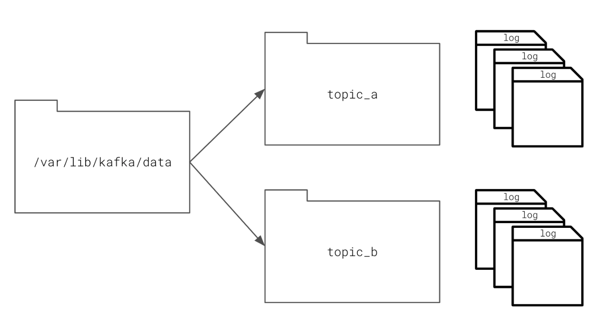

## 3. Message Ordering
Message ordering is only guaranteed within a partition in Kafka. If your topic has more than one partition, Kafka provides no guarantees that the messages will be consumed in the order they were produced. For many applications, this is an acceptable tradeoff for increasing the parallelism and speed of consumption. Your producer applications may still add metadata to the event header or message body itself to indicate ordering. However, this logic would belong to your application, and not Kafka itself. For example, you may place an increasing ID sequence in every message (eg 1, 2, 3, and so on) or a granular timestamp to indicate the order of a message.

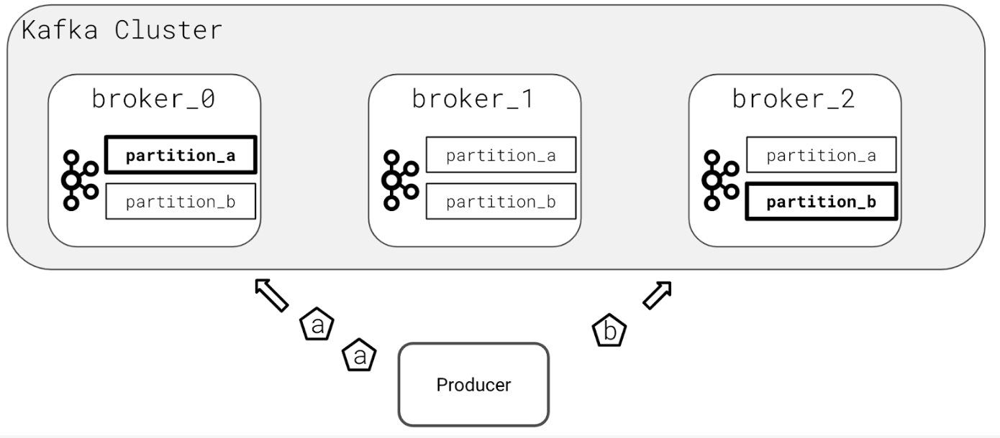

## 4. Preventing Data Loss
Based on an understanding that machines can fail, one of the core features of Kafka is the concept of replication.

* **Replication** – when the data is written to many brokers
* **Leader Broker** – the broker responsible for sending and receiving data to clients for a given topic partition
* **Replicas** – any brokers that are storing replicated data

If the leader broker were to fail, one of the replicas would be elected the new topic partition leader by the Kafka controller.

The exact number of replicas used can be configured globally as a Kafka server configuration item or set individually on every topic you create. But keep a few things in mind:
1. You can not have more replicas than brokers
2. Data replication has overhead
3. Always enable replication in a production cluster to prevent data loss

## 5. Configuring Kafka Topics
* Kafka uses data replication to duplicate data across multiple machines to prevent data loss in case a broker fails.
* Commonly the desired replication factor is set at the topic level and the value should always be specified when creating a topic.
* If a leader broker fails or is removed from a cluster, a replica broker will become the new leader.
* To become a new leader, the broker must be an In-Sync Replica (ISR)
* Configuration in Kafka includes configuring the desired number of ISRs.
* If the number of ISRs is too large this can slow down processing.

## 6. Partitioning Topics
* The “right” number of partitions is highly dependent on the scenario.
* The most important number to understand is desired throughput. How many MB/s do you need to achieve to hit your goal?
* You can easily add partitions at a later date by modifying a topic.
* Partitions have performance consequences. They require additional networking latency and potential rebalances, leading to unavailability.
* Determine the number of partitions you need by dividing the overall throughput you want by the throughput per single consumer partition or the throughput per single producer partition. Pick the larger of these two numbers to determine the needed number of partitions.

$$
\text{Partitions} = \max\left(
\frac{\text{Overall Throughput}}{\text{Producer Throughput}},
\frac{\text{Overall Throughput}}{\text{Consumer Throughput}}
\right)
$$
$$
\begin{aligned}
\text{Partitions}
&= \max\left(
\frac{100\ \text{MB/s}}{3 \times 10\ \text{MB/s}},
\frac{100\ \text{MB/s}}{5 \times 10\ \text{MB/s}}
\right) \\
&= \max\left(\frac{100}{30}, \frac{100}{50}\right) \\
&= \max(3.33, 2.00) \\
&\approx 4
\end{aligned}
$$
**Result:** $\boxed{4\text{ partitions needed}}$

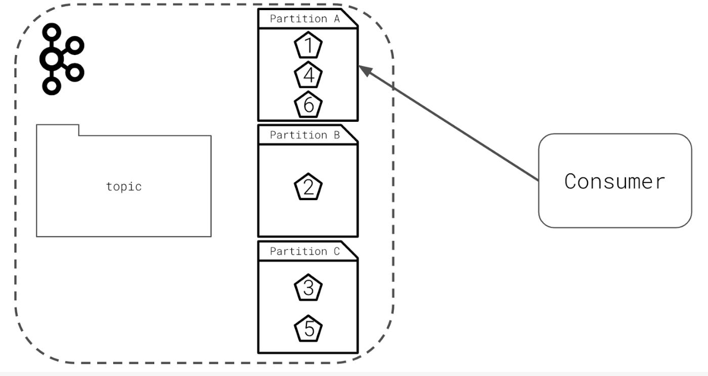

[How to choose the number of partitions](https://www.confluent.io/blog/how-choose-number-topics-partitions-kafka-cluster/)

## 7. Kafka Naming Conventions
* The only enforced rules for topic names are that they must be less than 256 characters, consist only of alphanumeric characters (a-z, A-Z, 0-9), “.”, “_”, or “-”.
* There is no idiomatic or universally correct naming convention.
* Naming conventions can help reduce confusion, save time, and even increase reusability.
* Example of a naming convention:
    * Consider starting with a namespace, like `com.udacity`.
    * Consider segmenting on schema or model type, like `com.udacity.lesson`, where `lesson` is the model.
    * Consider segmenting on event type, like `com.udacity.lesson.quiz_complete`, where `quiz_complete` is the event.

## 8. Topic Data Management
* Data retention determines how long Kafka stores data in a topic.
* When data expires it is deleted from the topic.
    * Retention policies may be time based. Once data reaches a certain age it is deleted.
    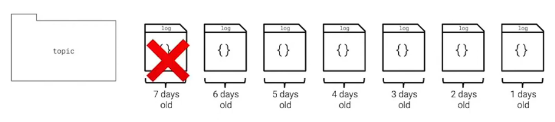
    * Retention policies may be size based. Once a topic's log size reaches a configured limit, the oldest data is deleted.
    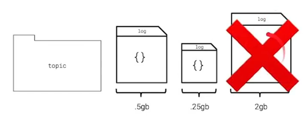
    * Retention policies may be both time- and size-based. Once either condition is reached, the oldest data is deleted.
    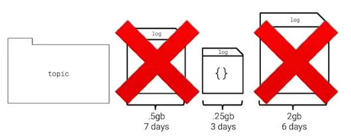
    * Alternatively, topics can be compacted in which there is no size or time limit for data in the topic.
    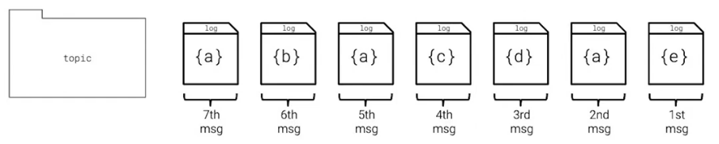
* Compacted topics use the message key to identify messages uniquely. If a duplicate key is found, the latest value for that key is kept, and the old message is deleted.
* Kafka topics can use compression algorithms to store data. This can reduce network overhead and save space on brokers. Supported compression algorithms include: `lz4`, `zstd`, `snappy`, and `gzip`.
* Kafka topics should store data for one type of event, not multiple types of events. Keeping multiple event types in one topic will cause your topic to be hard to use for downstream consumers.

## 9. Topic Creation
There are a number of ways to configure topics in Kafka and while topics may be created automatically, manual creation is a best practice. Helpful alternatives for topic creating include:
* Writing code in producer applications to see if a topic already exists, if it doesn't then the producer can configure and create the topic.
* Using Bash scripts or an infrastructure provisioning tool to create topics.

## 10. Kafka Producer
### 10.1 Synchronous Production
The synchronous producer is the simplest type of Kafka producer, it:
* sends data to Kafka.
* blocks program execution until the message receipt has been confirmed by the broker.
* is useful when you want to ensure data is sent before moving an application forward.
* should be used for specific use cases and not as a default producer type.
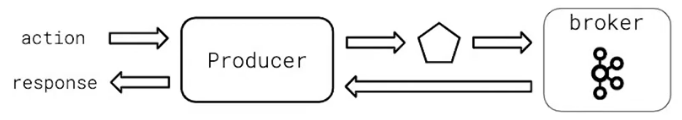
### 10.2 Asynchronous Production
Asynchronous production of Kafka is the most common method of producing data to topics. A few key points to remember about asynchronous producers:
* they send the data and immediately continue.
* they are useful when maximizing throughput to Kafka with the least overhead and impact on the integrated application.
* they should be the default choice unless the specific use case requires synchronicity.

Kafka clients offer callbacks for when messages are delivered or an error occurs so that applications can take rectifying action. Conversely, producers can decide to fire and forget and never check for delivery confirmation or error messages.
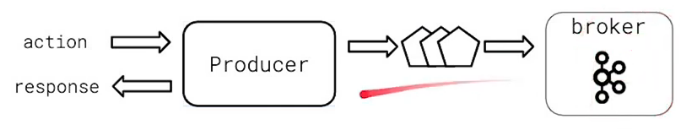

### 10.3 Message Serialization
* Data sent to Kafka should be serialized into a format.
* Kafka client libraries can assist in serialization.
* Formats inlcude binary, string, csv, JSON, Avro.
* Never change serialization type without a new topic!

### 10.4 Producer Configuration
* It is a good idea to always set the `client.id` for improved logging, debugging, and resource limiting.
* The `retries` setting determines how many times the producer will attempt to send a message before marking it as failed.
* If ordering guarantees are important to your application and you've also enabled retries, make sure that you set `enable.idempotence` to `true`.
* Producers may choose to compress messages with the `compression.type` setting:
    - Options are `none`, `gzip`, `lz4`, `snappy`, and `zstd`.
    - Compression is performed by the producer client if enabled
    - If the topic has its own compression setting, it must match the producer setting, otherwise the broker will decompress and recompress the message into its configured format.
* The `acks` setting determines how many In-Sync Replica (ISR) Brokers need to have successfully received the message from the client before moving on:
    - A setting of -1 or all means that all ISRs will have successfully received the message before the producer proceeds.
    - Clients may opt to set this to 0 for performance reasons.
* The diagram below illustrates how the topic and producer may have different compression settings. However, the setting at the topic level will always be what the consumer sees.

Message Compression Types:
| Algorithm | Pros | Cons |
|----------|------|------|
| **lz4** | Fast compression and decompression | Not a high compression ratio |
| **snappy** | Fast compression and decompression | Not a high compression ratio |
| **zstd** | High compression ratio | Not as fast as lz4 or snappy |
| **gzip** | Ubiquitous, widely supported | CPU-intensive; significantly slower than lz4 or snappy |

### 10.5 Batching Configuration
When Kafka client libraries send data to Kafka, they do not send every message individually. Instead, the client libraries collect groups of messages together and then send them to the Kafka broker.
* Batches – the collection of groups of messages that are sent to a Kafka broker, used to improve application performance

The count, frequency, and quantity of data sent in these batches are customizable.

## 11. Kafka Consumer
`client.id` is an optional setting which is useful in debugging and resource limiting.
* Poll for data to read data from Kafka
    - `poll`
    - `consume`

### 11.1 Consumer Offsets
Kafka keeps track of what data a consumer has seen with offsets
* Kafka stores offsets in a private internal topic.
* Most client libraries automatically send offsets to Kafka for you on a periodic basis.
* You may opt to commit offsets yourself, but it is not recommended unless there is a specific use-case.
* Offsets may be sent synchronously or asynchronously.
* Committed offsets determine where the consumer will start up.
    - If you want the consumer to start from the first known message, `[set auto.offset.reset to earliest]`.
    - This will only work the first time you start your consumer. On subsequent restarts it will pick up wherever it left off.
    - If you always want your consumer to start from the earliest known message, you must manually assign your consumer to the start of the topic on boot.
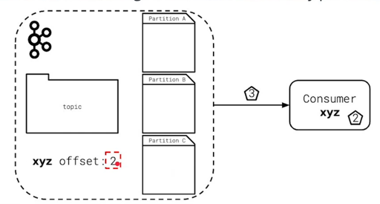
### 11.2 Consumer Groups
* All Kafka Consumers belong to a Consumer group
    - The `group.id` parameter is required and identifies the globally unique consumer group.
    - Consumer groups consist of one or more consumers.
* Consumer groups increase throughput and processing speed by allowing many consumers of topic data. However, only one consumer in the consumer group receives any given message, because each partition is assigned to only one consumer within the group at a time.
* If your application needs to inspect every message in a topic, create a consumer group with a single member.
* Adding or removing consumers causes Kafka to rebalance
    - During a rebalance, a broker group coordinator identifies a consumer group leader.
    - The consumer group leader reassigns partitions to the current consumer group members.
    - During a rebalance, messages may not be processed or consumed.
* Consumer groups increase fault tolerance and resiliency by automatically redistributing partition assignments if one or more members of the consumer group fail
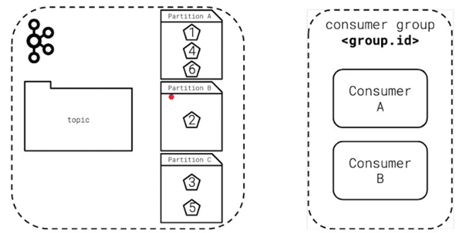
### 11.3 Consumer Subscriptions
* You subscribe to a topic by specifying its name.
    - If you wanted to subscribe to `com.udacity.lesson.views`, you would simply specify the full name as `com.udacity.lesson.views`.
    - Make sure to set `allow.auto.create.topics` to false so that the topic isn't created by the consumer if it does not yet exist.
* One consumer can subscribe to multiple topics by using a regular expression
    - The format for the regular expression is slightly different. If you wanted to subscribe to com.udacity.lesson.views.lesson1 and com.udacity.lesson.views.lesson2 you would specify the topic name as `^com.udacity.lesson.views.*`
    - The topic name must be prefixed with `^` for the client to recognize that it is a regular expression, and not a specific topic name.
    - The `^` prefix in the topic name string is all that is needed — no additional parameter is required.
    - See the `confluent_kafka_python` `subscribe()` documentation for more information.

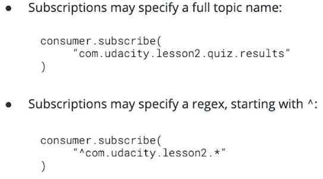

**Topic Rebalance**: An operation where consumers in a consumer group are assigned a partition.
### 11.4 Consumer Deserializers
Remember to deserialize the data you are receiving from Kafka in an appropriate format:
* If the producer used JSON, you will need to deserialize the data using a JSON library.
* If the producer used bytes or string data, you may not have to do anything.

### 11.5 Retrieving Data from Kafka
* Most Kafka Consumers will have a \u201cpoll\u201d loop which loops infinitely and ingests data from Kafka.
* Here is a sample poll loop:
```python
while True:
    message = consumer.poll(1.0)
    if message is None:
        print("no message received by consumer")
    elif message.error() is not None:
        print(f"error from consumer {message.error()}")
    else:
        print(f"consumed message {message.key()}: {message.value()}")
```
* It is possible to use either `poll` or `consume`, but `poll` consumes one message at the time and it is slightly more feature rich. `consume` can fetch multiple messages at once.
```python
while True:
    messages = consumer.consume(5, timeout=1.0)

    for message in messages:
        if message is None:
            continue  # No data was retrieved

        elif message.error() is not None:
            continue  # Log error in production

        else:
            print(message.key(), message.value())
```
* Make sure to call `close()` on your consumer before exiting and to consume any remaining messages.
    - Failure to call `close` means the Kafka Broker has to recognize that the consumer has left the consumer group, which takes time and failed messages. Try to avoid this if you can.
## 12. Performance
### 12.1 Consumer Performance
The most important metric to understand for your Kafka Consumer is **consumer lag**.
$$
\text{Lag} = \text{Latest Topic Offset} - \text{Consumer Topic Offset}
$$
```bash
kafka-consumer-groups.sh --bootstrap-server <host:port> --describe --group <group-id>
```
If you notice that the consumer lag number continues to grow over time, though, that is an indicator that your consumer cannot keep up. In that case, you typically will need additional consumer processes in order to keep up.

Another important metric to measure is the **number of messages per second passing through your Kafka topic**.
* This number indicates the throughput of your topic.
* It can be useful in understanding if you're meeting performance goals.
* It is typically calculated in conjunction with consumer lag.

Kafka emits metrics for throughput via the Java Metrics Exporter, or JMX, so that you can hook this metric directly into your monitoring dashboards and alerting systems.

### 12.2 Producer Performance
When a producer sends messages to Kafka, there is always some inherent latency in that process. Ideally, that latency number is small and consistent.
$$
\text{Latency} = \text{Time Broker Received} - \text{Time Produced}
$$
* High latency can indicate that your `acks` setting is too high and that too many ISRs nodes must confirm the message before returning.
* It may also indicate that too many partitions or replicas have been assigned to this topic.

Another metric to keep your eyes on is the **producer response rate**. This metric is an indicator of how many messages are being delivered over time.
* All of these metrics may be created by using producer delivery callbacks in the client library.

If Kafka producer experiences high latency investigate:
* Are there too many partitions?
* Is the `acks` setting appropriate?
* Does the topic require too many replicas and ISRs?

### 12.3 Broker Performance
The Kafka broker is the conduit through which data in a system flows.
* First, disk usage should be monitored as Kafka retains data, sometimes indefinitely.
* Network usage is a critical metric to measure.
* Election frequency is another important metric.

Consequences of a saturated network on a broker:
* Data Loss
* Downtime
* Stopped Consumption
* Stopped Production
* Broker Elections (sign of an unstable cluster)

Further read:
* [DataDog blog post on monitoring Kafka](https://www.datadoghq.com/blog/monitoring-kafka-performance-metrics/).
* [Confluent article on monitoring Kafka](https://docs.confluent.io/platform/current/kafka/monitoring.html).
* [New Relic article on monitoring Kafka](https://newrelic.com/blog/observability?has_gdpr=true).

## 13. Record Removal & Data Privacy
This is a serious issue in a world where privacy regulations are increasingly giving consumers the right to be forgotten. Regulations like the EU’s GDPR and the California Consumer Privacy Act, or CCPA, grant citizens of these regions the right to request that their data be removed from storage.

### 13.1 Message Compaction
Kafka supports message expiration:
* Kafka can expire messages based on time, topic size, or both.

However, some use cases disallow the use of message expiration to manage user data. When this occurs, use **log compaction** instead of log expiration to manage a user’s personal data.
* With a compacted topic, you can continue to publish updates to a particular message as long as the keys match.
* A message with a matching key and a null value tells the Kafka broker that it should delete the key on the next compaction, effectively deleting the message.
* There are log compaction timing settings on the topic.

One of the major problems with this approach, however, is that user data may be spread through many topics, and not always keyed on the user ID. So, unfortunately, this strategy is typically not enough.

### 13.2 Per-User Key Encryption
**Encrypted User Keys** – create a topic that maps a user id to an encryption key.
* Used to encrypt any data related to a user before putting it into any other Kafka topic.
* Vastly reduces the management overhead of deleting user data.

To delete the user, simply compact and delete their encryption key from the encrypted user key topic. Once the key is gone, it is effectively impossible for any application in the system to decrypt the user’s data ever again.

## 14. Summary
* A Kafka Broker is an individual Kafka server.
* A Kafka Cluster is a group of Kafka Brokers.
* Kafka historically used ZooKeeper to elect topic leaders and store its own configuration, but modern Kafka versions use KRaft mode to manage this internally.
* Kafka writes log files to disk on the Kafka brokers themselves.
* How Kafka achieves scale and parallelism with topic partitions.
* How Kafka provides resiliency and helps prevent data loss with data replication.
* Kafka is secured via mutual TLS (mTLS) or Simple Authentication and Security Layer (SASL). For hobbyist usage, Kafka is typically run unencrypted. However, if you are using Kafka at your job, or to transport sensitive information, you should either invest the time to secure Kafka or work with your company's security team to help you accomplish this.

## 15. Glossary
* **Broker** (Kafka) - A single member server of the Kafka cluster.
* **Cluster** (Kafka) - A group of one or more Kafka Brokers working together to satisfy Kafka production and consumption.
* **Node** - A single computing instance. May be physical, as in a server in a datacenter, or virtual, as an instance might be in AWS, GCP, or Azure.
* **Zookeeper** - Historically used by Kafka Brokers to determine which broker is the leader of a given partition and topic, as well as track cluster membership and configuration. ZooKeeper has been deprecated as of Kafka 3.3 and replaced by KRaft (Kafka Raft) mode in modern Kafka deployments.
* **Access Control List (ACL)** - Permissions associated with an object. In Kafka, this typically refers to a user’s permissions with respect to production and consumption, and/or the topics themselves.
* **JVM - The Java Virtual Machine** - Responsible for allowing host computers to execute the byte-code compiled against the JVM.
* **Data Partition (Kafka)** - Kafka topics consist of one or more partitions. A partition is a log which provides ordering guarantees for all of the data contained within it. Partitions are chosen by hashing key values.
* **Data Replication (Kafka)** - A mechanism by which data is written to more than one broker to ensure that if a single broker is lost, a replicated copy of the data is available.
* **In-Sync Replica (ISR)** - A broker which is up to date with the leader for a particular broker for all of the messages in the current topic. This number may be less than the replication factor for a topic.
* **Rebalance** - A process in which the current set of consumers changes (addition or removal of consumer). When this occurs, assignment of partitions to the various consumers in a consumer group must be changed.
* **Data Expiration** - A process in which data is removed from a Topic log, determined by data retention policies.
* **Data Retention** - Policies that determine how long data should be kept. Configured by time or size.
* **Batch Size** - The number of messages that are sent or received from Kafka
* `acks` - The number of broker acknowledgements that must be received from Kafka before a producer continues processing.
* **Synchronous Production** - Producers which send a message and wait for a response before performing additional processing.
* **Asynchronous Production** - Producers which send a message and do not wait for a response before performing additional processing.
* **Avro** - A binary message serialization format.
* **Message Serialization** - The process of transforming an applications internal data representation to a format suitable for interprocess communication over a protocol like TCP or HTTP.
* **Message Deserialization** - The process of transforming an incoming set of data from a form suitable for interprocess communication, into a data representation more suitable for the application receiving the data.
* **Retries (Kafka Producer)** - The number of times the underlying library will attempt to deliver data before moving on.
* **Consumer Offset** - A value indicating the last seen and processed message of a given consumer, by ID.
* **Consumer Group** - A collection of one or more consumers, identified by `group.id` which collaborate to consume data from Kafka and share a consumer offset.
* **Consumer Group Coordinator** - The broker in charge of working with the Consumer Group Leader to initiate a rebalance.
* **Consumer Group Leader** - The consumer in charge of working with the Group Coordinator to manage the consumer group.
* **Topic Subscription** - Kafka consumers indicate to the Kafka Cluster that they would like to consume from one or more topics by specifying one or more topics that they wish to subscribe to.
* **Consumer Lag** - The difference between the offset of a consumer group and the latest message offset in Kafka itself.
* **CCPA** - California Consumer Privacy Act.
* **GDPR** - General Data Protection Regulation.