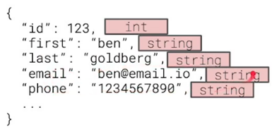
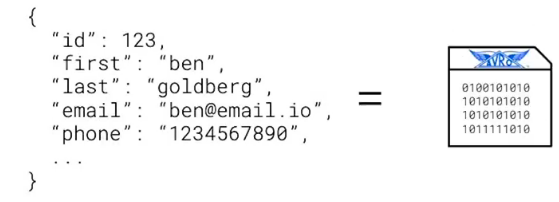
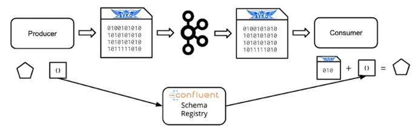

# Data Schemas and Apache Avro
## 1. Understanding Data Schemas
* Data schemas help us define:
    - The shape of the data
    - The names of fields
    - The expected types of values
    - Whether certain data fields are optional or required.
* Data schemas describe the expected keys, value types, and whether certain keys are optional or required.
* Data schemas provide expectations for applications so that they can properly ingest or produce data that match that specification
* Data schemas are used for communication between software
* Data schemas can help us create more efficient representations with compression
* Data schemas help systems develop independently of each other
* Data schemas are critical in data systems and applications today
    - gRPC in Kubernetes
    - Apache Avro in the Hadoop Ecosystem



## 2. Apache Avro
**Apache Avro** is a data serialization system that uses a binary data format.
* when data in an application is shared in the Avro format, it is compressed into a binary format over the network
* this binary format improves speed over the network and can help reduce storage overhead
* this binary formatted data includes the application data serialized according to an Avro schema, but does not include the schema definition itself.

When clients receive data from an application in Avro format, they receive the serialized data, but the Avro schema — which defines how to deserialize the data from binary into their own application data model representation — must be shared separately or managed via a schema registry.



* Apache Avro records are defined in JSON.
* Avro records include a required name, such as "user".
* Avro records must include a type defined as `record`.
* Avro records may optionally include a namespace, such as "com.udacity".
* Avro records are required to include an array of fields that define the names of the expected fields and their associated type. Such as "fields": `[{"name": "age", "type": "int"}]`.
* Avro can support optional fields by specifying the field type as either null or some other type. Such as `"fields": [{"name": "age", "type": [“null”, "int"]}]`.
* Avro records are made up of complex and primitive types
    - Complex types are other records, arrays, maps, and others
Here is what a stock ticker price change schema might look like:
```json
{
  “type”: “record”,
  “name”: “stock.price_change”,
  “namespace”: “com.udacity”,
  “fields”: [
      {“name”: “ticker”, “type”: “string”},
      {“name”: “prev_price”, “type”: “int”},
      {“name”: “price”, “type”: “int”},
      {“name”: “cause”, “type”: [“null”, “string”]}
  ]
}
```

### 2.1 Data Types
* Primitive Types should be familiar, as they closely mirror the built-in types for many programming languages.
    - `null`
    - `boolean`
    - `int`
    - `long`
    - `float`
    - `double`
    - `bytes`
    - `string`
* Complex Types allow nesting and advanced functionality.
    - `records`
    - `enums`
    - `maps`
    - `arrays`
    - `unions`
    - `fixed`

## 3. Schema Registry
**Confluent Schema Registry** is an open-source tool that provides centralized Avro Schema storage.

Sending an Avro schema definition alongside every message:
* introduces some additional network and storage overhead in our producer and consumer applications.
* introduces additional work on the consumer and producer to correctly serialize and deserialize from Avro.

Schema Registry is a tool built by Confluent and deployed alongside Apache Kafka that can help reduce some of the overhead involved with using Avro.
* if Schema Registry is in use in a cluster, there is no need to send full schemas alongside payloads to Kafka
* the Kafka client can be configured to send the schema to the schema registry over HTTP instead

Schema Registry:
* assigns the named schema a version number.
* stores the version number in a private topic and the producer never needs to send the schema to either the Schema Registry or the Kafka broker, until the schema definition is updated again.
* can pull historical schemas as well, so all data stored in the Kafka topic can be deserialized by clients.
* does not support deletes by default.
* can be used by any application that wants to efficiently store and retrieve schema data across multiple versions.
* is typically used by Kafka clients, but it has also been utilized by applications that are not interacting with Kafka.

When using schema registry, Consumers and producers only fetch a schema when they don’t have it in memory. Once they’ve fetched a schema version, it is never fetched again. This can dramatically decrease networking overhead for high-throughput topics.



At it's core, Schema Registry is simply a web server built on the JVM using Java and Scala.
* It is highly portable.
* It will run on just about any operating system.
* It utilizes Kafka itself to store data in a schemas topic.
* Exposes an HTTP web-server with a REST API.
* It uses compaction to ensure that no data loss occurs.

## 4. Schema Evolution
**Schema evolution** – the process of changing the data schema for a given dataset.

In other words, it means that a Kafka producer has modified the shape of the data, as well as the data schema, that it intends to send.

In practice, evolving a schema simply means updating the Avro definition and resubmitting the schema to schema registry with some compatibility information. 

## 5. Schema Compability
* Schema Evolution is caused by a modification to an existing data schema
    - Adding or removing a field
    - Making a field optional
    - Changing a field type
* Schema Registry can track schema compatibility between schemas
    - Compatibility is used to determine whether or not a particular schema version is usable by a data consumer
    - Consumers may opt to use this compatibility information to preemptively refuse to process data that is incompatible with its current configuration
    - Schema Registry supports four categories of compatibility
    - Backward / Backward Transitive
    - Forward / Forward Transitive
    - Full / Full Transitive
    - None
* Managing compatibility requires both producer and consumer code to determine the compatibility of schema changes and send those updates to Schema Registry

### 5.1 Backward Compability
* Backward compatibility means that consumer code developed against the most recent version of an Avro Schema can use data using the prior version of a schema without modification.
    - The deletion of a field or the addition of a new optional field is backward compatible changes.
    - Update consumers before updating producers to ensure that consumers can handle the new data type.
* The `BACKWARD` compatibility type indicates compatibility with the current version `(N)` and the immediately prior version `(N-1)`.
    - Unless you specify otherwise, Schema Registry always assumes that changes are BACKWARD compatible.
* The `BACKWARD_TRANSITIVE` compatibility type indicates compatibility with all prior versions `(1 → N)`.

### 5.2 Forward Compability
* Forward compatibility means that consumer code developed against the previous version of an Avro Schema can consume data using the newest version of a schema without modification.
    - The deletion of an optional field or the addition of a new field is forward compatible changes.
    - Producers need to be updated before consumers.
* The `FORWARD` compatibility type indicates that data produced with the latest schema (`N`) is usable by consumers using the previous schema version `(N-1)`.
* The `FORWARD_TRANSITIVE` compatibility type indicates that data produced with the latest schema (`N`) is usable by all consumers using any previous schema version (`1 → N-1`).

### 5.3 Full Compability
* Full compatibility means that consumers developed against the latest schema can consume data using the previous schema, and that consumers developed against the previous schema can consume data from the latest schema as well. In other words, full compatibility means that a schema change is both forward and backward compatible.
    - Changing the default value for a field is an example of a full compatible change.
    - The order in which producers or consumers are updated does not matter.
* The `FULL` compatibility type indicates that data produced is both forward and backward compatible with the current (`N`) and previous (`N-1`) schema.
* The `FULL_TRANSITIVE` compatibility type indicates that data produced is both forward and backward compatible with the current (`N`) and all previous (`1 → N-1`) schemas.

### 5.4 No Compability
* No compatibility disables compatibility checking by Schema Registry.
    - In this mode, Schema Registry simply becomes a schema repository.
* Use of `NONE` compatibility is not recommended.
* Schemas will sometimes need to undergo a change that is neither forward nor backward compatible.
    - Best practice is to create a new topic with the new schema and update consumers to use that new topic.
    - Managing multiple incompatible schemas within the same topic leads to runtime errors and code that is difficult to maintain.

## 6. Glossary
* **Data Schema** - Define the shape of a particular kind of data. Specifically, data schemas define the expected fields, their names, and value types for those fields. Data schemas may also indicate whether fields are required or optional.
* **Apache Avro** - A data serialization framework which includes facilities for defining and communicating data schemas. Avro is widely used in the Kafka ecosystem and data engineering generally.
* **Record** (Avro) - A single encoded record in the defined Avro format
* **Primitive Type** (Avro) - In Avro, a primitive type is a type which requires no additional specification - null, boolean, int, long, float, double, bytes, string.
* **Complex Type** (Avro) - In Avro, a complex type models data structures which may involve nesting or other advanced functionality: records, enums, maps, arrays, unions, fixed.
* **Schema Evolution** - The process of modifying an existing schema with new, deleted, or modified fields.
* **Schema Compatibility** - Determines whether or not two given versions of a schema are usable by a given client
* **Backward Compatibility** - means that consumer code developed against the most recent version of an Avro Schema can use data using the prior version of a schema without modification.
* **Forward Compatibility** - means that consumer code developed against the previous version of an Avro Schema can consume data using the newest version of a schema without modification.
* **Full Compatibility** - means that consumers developed against the latest schema can consume data using the previous schema, and that consumers developed against the previous schema can consume data from the latest schema as well. In other words, full compatibility means that a schema change is both forward and backward compatible.
* **None Compatibility** - disables compatibility checking by Schema Registry.