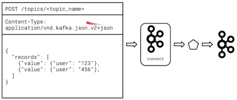
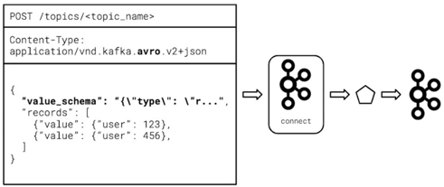
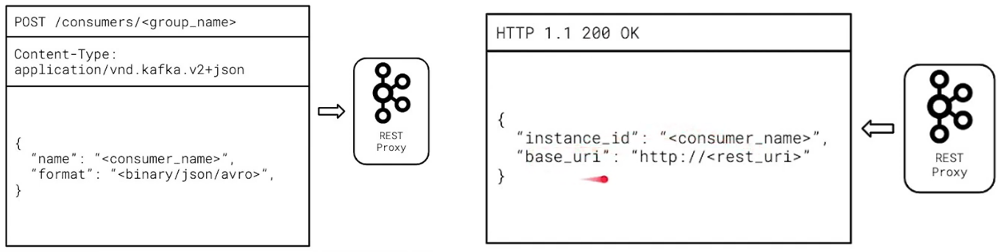
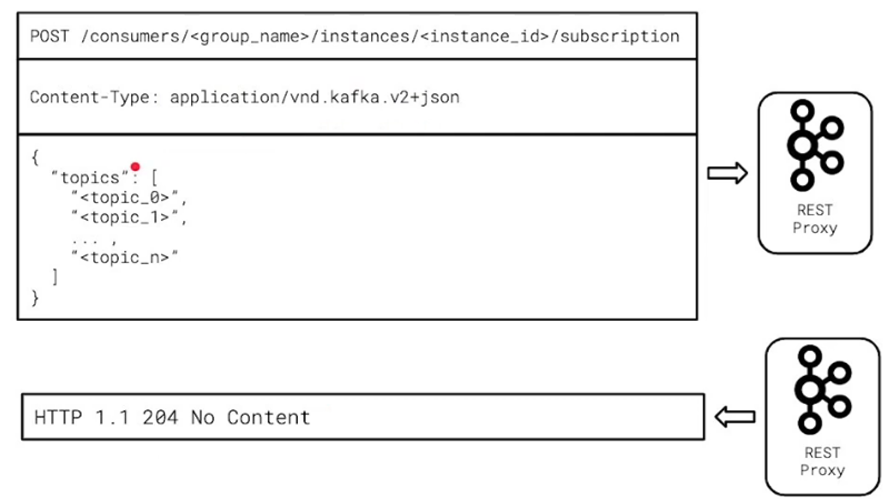
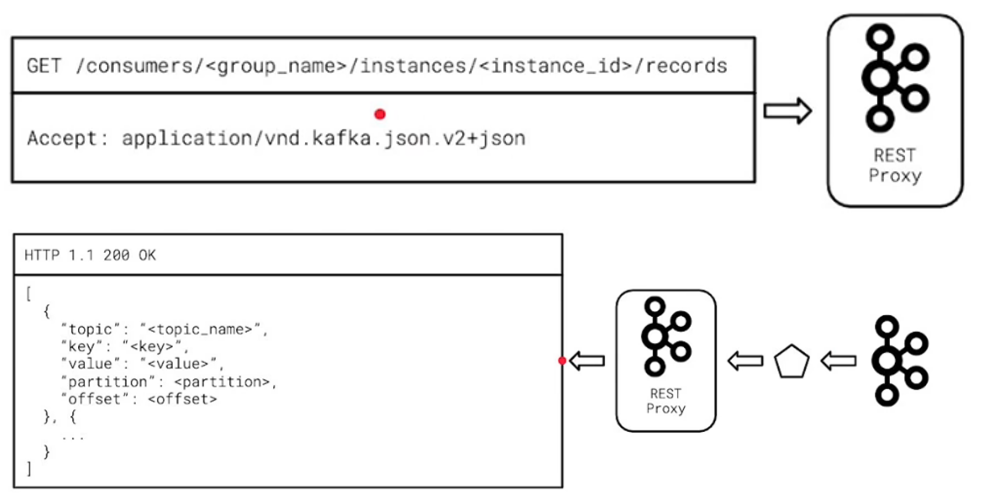
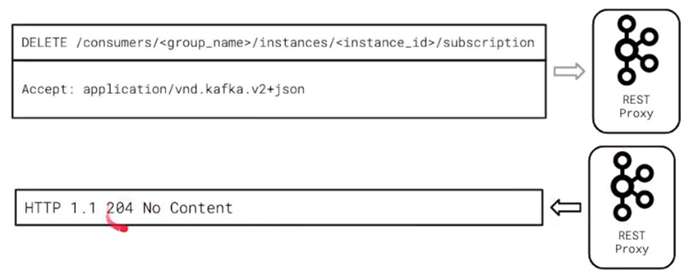

# Kafka Konnect and REST Proxy
## 1. Kafka Konnect
Kafka Connect to quickly integrate common data sources into Kafka, and move data from Kafka into other data stores.

Kafka Connect is a framework and runtime for integrating Kafka with external data sources such as SQL databases, log files, and HTTP endpoints.

Pluggable framework for building reusable Kafka producers and consumers. The result of their effort was **Kafka Connect**. Kafka Connect is a framework, written in Java, which:
* allows developers to build an integration once.
* then use it repeatedly with just a bit of configuration.
* makes it possible to avoid integrating Kafka client code into your applications entirely.

### 1.1 Kafka Connect Architecture
Kafka Connect is an extension of the Kafka project and is built in Scala and Java. Because it is built on the JVM, Kafka Connect can run on most types of hardware and operating systems.

On its own, Kafka Connect is a web server. For Kafka Connect to be able to interact with the outside world, it needs plugins to tell it how to do so.

Kafka Connect plugins:
* implement the actual functionality
* must be implemented against the connect framework API
* are written in a JVM language, like Java

Kafka Connect uses Kafka to store its configuration and track its internal state and it can be run as a single node, or as a cluster.

Kafka Connect plugins are similar to the Kafka consumers and producers you’ve already built! At a high level, every Kafka Connect plugin defines a few things.: 
* **Connectors**: which are a high-level abstraction responsible for managing tasks.
* **Tasks**: the units of work that perform the actual data copying between Kafka and the external system, executing the logic defined by the connector.
* **Converters**: which are responsible for defining the mapping between the source or destination system and Kafka Connect and can be used to turn data into Avro or JSON.

### 1.2 Kafka Connect Connectors
Most common connector categories:
* Local file source and sink – for moving logs into and out of Kafka.
* Cloud Key Value Store - e.g., AWS S3.
* Traditional SQL databases such as MySQL or postgres are also common and useful plugins.
* HDFS data sources - e.g., Interacting with Hadoop.
* REST APIs

### 1.3 Kafka Connect REST API
* Your Connector configuration can be Created, Updated, Deleted and Read (CRUD) via a REST API.
* You can check the status of a specific Connectors task(s) via the API.
* You can start, stop, and restart Connectors via the API.
* The choice of a REST API provides a wide-array of integration and management opportunities.

### 1.4 Kafka Connect FileStream Source
Kafka Connect can be configured to use a **FileStream Source Connector** to monitor changes in a file on disk. As data in that file changes, Kafka captures those changes and emits each new line as an event to a Kafka topic.

Apply the Kafka Connect FileStream Source connector to push logs into Kafka.

One of the most common uses of Kafka in many organizations is the routing of log data from many disparate microservices.

### 1.5 Kafka Connect JDBC Source
* JDBC = Java Database Connectivity. The JDBC API is used to abstract the interface to SQL Databases for Java applications. In the case of Kafka Connect, JDBC is used to act as a generic interface to common databases such as MySQL, Postgres, etc.
* JDBC Sources are a common way to move data into Kafka from existing databases. Once the data is available in Kafka, it can be used in stream processing operations to enrich data or provide insights that may otherwise be missing.
* JDBC Sinks are a common way to move data out of Kafka to traditional SQL datastores. This is a common way of making stream processing insights available for more ad-hoc or batch querying.

Apply the Kafka Connect JDBC Source connector to push SQL data into Kafka.

## 2. Kafka REST Proxy
REST Proxy to consume and produce data to and from Kafka using only an HTTP client.

Some applications, for legacy reasons or otherwise, will not be able to integrate a Kafka client directly. Kafka REST Proxy can be used to send and receive data to Kafka topics in these scenarios using only HTTP.

* Is a web server built in Java and Scala that allows any client capable of HTTP to integrate with Kafka
* Allows production and consumption of Kafka data
* Allows read-only operations on administrative information and metadata

### 2.1 Kafka REST Proxy Architecture
**REST Proxy** is written in Scala and Java and runs on the JVM. Because of this choice, REST Proxy can run just about anywhere.
* REST Proxy is a simple HTTP web server and can be deployed to just one instance, or a cluster of many instances.
* REST Proxy transforms structured JSON data from an application to Kafka’s binary format and can translate data from Kafka into a JSON payload for an application.
* REST proxy can optionally be made aware of Schema Registry so that it can help you manage your Avro schemas.

REST proxy is most useful when you really can’t use a Kafka client directly. If using a Kafka client is possible, it is strongly preferable to take that route.

Kafka clients not only help abstract some of the interaction with Kafka in a more efficient way than REST proxy, but they also have substantial speed and payload size benefits as well.

### 2.2 Using REST Proxy
`POST` data to kafka REST Proxy to produce data.

Avro data may be published but you must always include the schema.

Always make sure you have the right `Content-Type` Header!

| Data Serialization Format | Content-Type Header |
|---------------------------|---------------------|
| Binary (Base64-encoded String, etc) | `application/vnd.kafka.binary.v2+json` |
| JSON | `application/vnd.kafka.json.v2+json` |
| Avro | `application/vnd.kafka.avro.v2+json` |

### 2.3 Consuming Data with REST Proxy
Consumption begins with a `POST` to create a Consumer Group

Next, `POST` to the subscribe endpoint

Once the consumer is subscribed, we can use HTTP GET to fetch records.

`DELETE` your consumer subscription when shutting down.

## 3. Glossary
* **Kafka Connect** - A framework for scalable and reliable streaming data integration between Kafka and external data sources such as SQL databases, log files, and HTTP endpoints.
* **JAR** - Java ARchive. Used to distribute Java code reusably in a library format under a single file.
* **Connector** - A JAR built on the Kafka Connect framework which integrates to an external system to either source or sink data from Kafka.
* **Source** - A Kafka client putting data into Kafka from an external location, such as a data store.
* **Sink** - A Kafka client removing data from Kafka into an external location, such as a data store.
* **JDBC** - Java Database Connectivity. A Java programming abstraction over SQL database interactions.
* **Task** - Responsible for actually interacting with and moving data within a Kafka connector. One or more tasks make up a connector.
* **Kafka REST Proxy** - A web server providing APIs for producing and consuming from Kafka, as well as fetching cluster metadata.